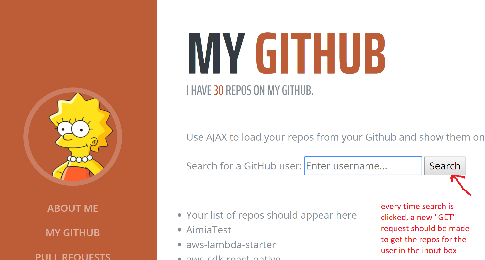

# My Resume

1. Fork and Clone this repo
2. run `npm install` then `npm start` (don't worry if you don't understand these commands now, we will explain them in Node module)
3. When you run `npm start`, your browser should open the webpage immediately with hot reload enabled (i.e. when you change files, they will automatically be reflected on the page).

## Github API

Github provides an **API** that provides a way for developers to retrieve information about in **JSON** format. We will spend most of our time using the `repos` **endpoint** which GETs the repos (repositories) of a specified user.

The documentation for the `repos` endpoint is available on: [https://developer.github.com/v3/repos/](https://developer.github.com/v3/repos/)

- Try to open this URI on the browser https://api.github.com/users/codeyourfuture/repos. What do you get back? Try changing *codeyourfuture* to your Github username, and see if you get back your list of repositories.

**Now to the requirements.**

## Part 1: My Github Page
### Requirement 1: Show my Repos
**Given** I am on the Resume site  
**When** I click on `My Github` link  
**Then** I should be presented with a list of repositories for my Github user

### Requirement 2: Add a link to my repo
**Given** I am on the `My Github` page  
**When** I am presented a list of my Repos  
**Then** each repo should have a link to go to the Github page

### Requirement 3: Display the number of Repos
**Given** I am on the Resume site  
**When** I click on `My Github` link  
**Then** I should be shown the number of repos in my Github account (in place of the `X`)

> The page `my-github.html` under the folder *pages* has a reference to the script `my-github.js` and the CSS file `my-github.css`. These are the files that you will need to change for these tasks.

## Part 2: Show Pull Requests submitted against js-exercises
**The API**: 
GET [https://api.github.com/repos/codeyourfuture/js-exercises/pulls](https://api.github.com/repos/codeyourfuture/js-exercises/pulls)

For the below 3 tasks, you'll need to work in: `pull-requests.html` & `pull-requests.js`

### Requirement 4: Show ALL Pull Requests
**Given** I am on the Resume site  
**When** I click on `My Pull Requests` page  
**Then** I should be shown a list of all *Pull Requests title* as a link  
**AND** the link should take me to the Pull Request on Github (use `html_url` property)

### Requirement 5: Show Only My Pull Requests

Update the previous requirement to only show your Pull Requests. Look at the `JSON` response and think how you can _filter_ the response

### Requirement 6: Search for my friend's Pull Requests

Update the previous page to add a `Search input`. This allows the user  to enter a Github user, and while they are searching, we should _filter_ the displayed list of Pull  Requests to only show that user's Pull Requests.

**Given** I am on the the Pull Requests page  
**When** I enter a *github user* in the *search box*  
**Then** I should be shown a list of *Pull Requests title* for that User only  

## Part 3: Update My Github Page to show other Github user's repos

### Requirement 7: Display someone else's repos in My Github

Update the **My Github** page to add a `Search input` and a `Search button`. This allows the user  to enter a Github user, and when they click **Search** then the page should display The  Pull Requests for that user.

**Given** I am on *My Github* page  
**When** I enter a *github user* in the *search box*  
**And** I click Enter  
**Then** I should be shown a list of the  repos for that User  

(stretch goal: if the search box is empty then it should default to my User)

> You will need to update the code in `my-github.js` to finish this final task.

## Bonus Task: Random API
Pick any random API from https://github.com/toddmotto/public-apis (**only those that don't require authentication (have Auth No)**) and create a page to use the API

Some ideas include [The  jokes API](https://github.com/15Dkatz/official_joke_api) to get random programming jokes, or the [Open Library API](https://openlibrary.org/developers/api) to search and retrieve information about Books, or [Wordnik](http://developer.wordnik.com/docs.html) to get definitions and example sentences for words, or getting [information about food and recipes](https://github.com/toddmotto/public-apis#food--drink) from a variety of APIs etc...

Make sure  to select an API that does not require Authentication, read its documentation for use with HTTP and to get the response in `JSON`.